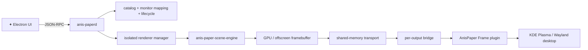

<div align="center">
  
</div>

<div align="center">

[](#)
[](#)
[](#)
[](#)

**A stylish live-wallpaper stack for KDE Plasma that renders Wallpaper Engine scenes outside `plasmashell` and sends frames back through a shared-memory bridge.**

</div>

<div align="center">
  
</div>

## ✦ Why this exists

**AnisPaper** exists for one simple reason:

> **make the desktop move, without making Plasma suffer for it.**

Instead of forcing `plasmashell` to do all the heavy work, AnisPaper pushes the expensive rendering path into a separate scene process and only gives Plasma the frame bridge it needs to display the result.

That means:

- ★ better separation between rendering and the desktop shell  
- ★ fewer “one broken wallpaper kills everything” moments  
- ★ a cleaner base for Scene, Video and Web wallpapers  
- ★ multi-monitor support that feels like an actual system, not a hack glued together at 4 AM

---

## ★ Features

| Feature | Status |
|---|---|
| KDE Plasma 6 / Wayland | ✅ |
| Steam library discovery | ✅ |
| Multiple Steam libraries | ✅ |
| Scene wallpapers | ✅ experimental but working |
| Shared-memory frame bridge | ✅ |
| Per-monitor wallpaper targeting | ✅ |
| Scene preview over RPC | ✅ |
| Video wallpapers | 🧪 |
| Web wallpapers | 🧪 |
| Renderer isolation / crash containment | ✅ |
| Pretty README with yellow stars | ✅ very important |

---

## ✦ Preview

> Replace the image paths below with **your own screenshots / GIFs from AnisPaper**.  
> I intentionally left these as repo-local placeholders so you can keep the README beautiful **without redistributing copyrighted art ripped from YouTube**.

<div align="center">

| App | Live wallpaper on monitor | Preview / debug |
|---|---|---|
|  |  |  |

</div>

**Suggested screenshots to add:**
- `assets/preview-ui.png` → the Electron UI with a wallpaper selected  
- `assets/preview-monitor.png` → the desktop actually showing the scene on DP-2  
- `assets/preview-previewframe.jpg` → the JPEG extracted from `preview.frame`

---

## ★ Architecture



### Scene path in one breath

```text
Wallpaper Engine Scene
        ↓
anis-paper-scene-engine
        ↓
offscreen render
        ↓
shared memory
        ↓
AnisPaper Frame
        ↓
KDE Plasma
```

---

## ✦ What makes it cool

### 1) The renderer is isolated
If a wallpaper crashes, it should be **the renderer's problem**, not Plasma's problem.

### 2) The monitor is explicit
You can target a specific output like **DP-2**, not just “some screen maybe.”

### 3) The bridge is real
The pipeline doesn't fake a wallpaper by just spawning a random window.  
It renders, transports frames, and displays them through a dedicated wallpaper plugin.

### 4) It is a proper project now
What started as _“please just make this work on my monitor”_ turned into a real architecture with documentation, cleanup rules and a public repo plan.

---

## ★ Build

```bash
git clone <your-repo-url>
cd WallpaperAnis

cmake -S . -B build -DCMAKE_BUILD_TYPE=Release
cmake --build build -j"$(nproc)"
```

Important targets:

```text
anis-paperd
anis-paper-scene-engine
anispaperframeprovider
anispaper-plasma-output-map
```

UI:

```bash
cd ui
npm install
npm run dev
```

---

## ✦ How to use

1. Install / build the native targets.
2. Install the Plasma wallpaper plugin.
3. Start `anis-paperd`.
4. Launch the Electron UI.
5. Choose a wallpaper.
6. Choose the target monitor.
7. Apply.
8. Smile if DP-2 finally behaves.

---

## ★ Project status

This project is **experimental**, but the core milestone is real:

- ✅ Scene wallpapers are being rendered by a dedicated engine
- ✅ frames reach Plasma through shared memory
- ✅ monitor targeting works
- ✅ the desktop survives

Things still worth improving:

- [ ] cleaner install flow  
- [ ] quieter UI error handling (`renderer unavailable` spam)  
- [ ] better documentation for packaging  
- [ ] more testing on other hardware / monitors  
- [ ] release automation / CI  
- [ ] polished screenshots and preview GIFs for the README

---

## ✦ Inspiration / style notes

I can absolutely use YouTube and other pages as **style inspiration** for the README layout:

- centered hero section  
- stronger visual hierarchy  
- divider graphics  
- “feature cards” feeling  
- a more premium presentation

But for the public repo I strongly recommend this rule:

> **Use your own screenshots of AnisPaper and your own SVG decorations.**  
> **Do not rip copyrighted character art or YouTube frames into the repo.**

So the “Anis Star” vibe here is expressed through:

- ★ yellow star cascades  
- ★ dark + gold theme  
- ★ a dramatic centered banner  
- ★ your own project screenshots  
- ★ a more playful voice

---

## ★ Contributing

Forks and pull requests are welcome.

Please read [CONTRIBUTING.md](CONTRIBUTING.md) before submitting changes.

AI-assisted contributions are allowed, but the same rules apply as with any other code:

- understand what you submit  
- review the diff  
- test it  
- respect licensing  
- do not commit private local junk, builds, or secrets

---

## ✦ Licensing

AnisPaper includes or integrates third-party components.

In particular, its Scene path is based on **linux-wallpaperengine** and must preserve the relevant upstream licenses and notices.

This repository should only contain:

- your own code
- third-party code you are allowed to redistribute
- your own screenshots / assets
- original decorative SVGs like the ones in this README pack

It should **not** contain:

- Wallpaper Engine proprietary assets
- Steam Workshop wallpapers
- images ripped from YouTube videos
- copyrighted character art you do not have the right to redistribute

---

<div align="center">
  
</div>

<div align="center">

## ✦ STAR POWERED ✦

**Make the desktop move. Keep Plasma alive.**

</div>
