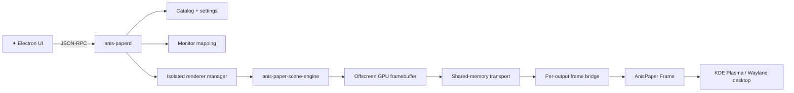

<div align="center">


<br>


<br>


# ✦ A N I S P A P E R ✦

### Live wallpapers for KDE Plasma — without making `plasmashell` do all the heavy lifting.

[](#)
[](#)
[](#)
[](#)

**Wallpaper Engine Scene • Video • Web • Multi-monitor • Shared Memory**

<br>

> **Experimental, open-source-oriented project. Testers, forks, bug reports and pull requests are welcome.**


</div>

---

## ✦ What is AnisPaper?

**AnisPaper** is an experimental live-wallpaper stack for **KDE Plasma 6**, built around one idea:

> **Make the desktop move without making Plasma do all the heavy rendering work.**

Instead of embedding the expensive renderer inside `plasmashell`, AnisPaper splits the work into separate components:

- ★ an Electron control UI
- ★ a native daemon (`anis-paperd`)
- ★ isolated renderers
- ★ a dedicated Wallpaper Engine Scene process
- ★ shared-memory frame transport
- ★ a minimal Plasma wallpaper plugin called **AnisPaper Frame**

The result is a pipeline where the wallpaper renderer can fail independently without taking the whole desktop shell with it.

---

## ★ Current milestone

The current Scene path is working end-to-end:

```text
Wallpaper Engine Scene
        ↓
anis-paper-scene-engine
        ↓
offscreen GPU framebuffer
        ↓
shared-memory transport
        ↓
anis-paperd / per-output bridge
        ↓
AnisPaper Frame
        ↓
KDE Plasma
```

On the original development setup, real Wallpaper Engine Scene projects have been rendered at roughly **58–60 FPS at 1920×1080**.

This is still an experimental project, not a polished consumer release.

---

## ✦ Features

| Feature | Status |
|---|---|
| KDE Plasma 6 | ✅ |
| Wayland desktop target | ✅ |
| Per-monitor wallpaper selection | ✅ |
| Steam library discovery | ✅ |
| Multiple Steam libraries | ✅ |
| Wallpaper Engine Scene projects | ✅ Experimental / working |
| Shared-memory Scene transport | ✅ |
| Renderer process isolation | ✅ |
| Preview RPC | ✅ |
| `cover` / `fit` / `stretch` scaling | ✅ |
| Video wallpapers | 🧪 |
| Web wallpapers | 🧪 |
| Renderer watchdog / safe-mode plumbing | ✅ |
| SDDM / login wallpaper integration | 🧪 Experimental |
| Packaged one-click installer | 🚧 Not yet |

---

## ★ Architecture



### Why separate processes?

A live wallpaper can contain broken assets, shaders, scripts or unsupported content.

AnisPaper tries to keep those failures away from `plasmashell`:

```text
broken wallpaper
      ↓
renderer process fails
      ↓
daemon detects the failure
      ↓
Plasma stays alive
```

That separation is one of the core goals of the project.

---

# ✦ Installation

> **Current installation method: build from source.**
>
> A packaged installer / distro package is planned later. For now, AnisPaper is aimed at testers and contributors who are comfortable building software.

---

## ★ 1. Requirements

### Desktop

Recommended/currently targeted:

- Linux
- **KDE Plasma 6**
- **Wayland**
- an OpenGL-capable GPU
- Steam
- a legitimate installation of **Wallpaper Engine** for Wallpaper Engine Scene content

The project does **not** include Steam Workshop wallpapers or Wallpaper Engine proprietary assets.

### Build dependencies

The native project currently needs:

- CMake 3.20+
- a C/C++20 toolchain
- `pkg-config`
- Wayland client libraries + `wayland-scanner`
- Qt 6:
  - Core
  - Network
  - Gui
  - OpenGL
  - Widgets
  - WebEngine
  - Quick
  - QML
  - DBus
- KDE Frameworks 6 Auth
- mpv
- libjpeg
- OpenGL / EGL
- GLEW
- GLUT
- zlib
- SDL2
- LZ4
- FFmpeg
- PulseAudio libraries
- Freetype
- DBus
- X11 development libraries

The Scene engine vendors its Wallpaper Engine rendering foundation inside `third_party/`.

### UI dependencies

For the Electron control UI:

- Node.js
- npm

---

## ★ 2. Arch Linux / CachyOS dependency example

AnisPaper is currently developed primarily on an Arch-family environment.

A practical dependency set is:

```bash
sudo pacman -S --needed \
  base-devel cmake pkgconf \
  qt6-base qt6-declarative qt6-webengine \
  kauth \
  wayland \
  mpv libjpeg-turbo \
  mesa glew freeglut \
  sdl2 lz4 ffmpeg libpulse freetype2 dbus \
  libx11 libxrandr libxinerama libxcursor libxi libxxf86vm \
  nodejs npm
```

Package names may differ on other distributions.

If CMake reports a missing package, treat the CMake error as the source of truth for your system.

---

## ✦ 3. Clone AnisPaper

```bash
git clone https://github.com/NixaXI/AnisPaper.git
cd AnisPaper
```

The currently required third-party renderer sources are already stored under:

```text
third_party/
```

---

## ★ 4. Configure a local user installation

A local prefix avoids installing development builds system-wide:

```bash
cmake -S . -B build \
  -DCMAKE_BUILD_TYPE=Release \
  -DCMAKE_INSTALL_PREFIX="$HOME/.local"
```

This configures the native daemon, renderer, Plasma plugin and helper targets.

---

## ✦ 5. Build

```bash
cmake --build build -j"$(nproc)"
```

Important targets include:

```text
anis-paperd
anis-paper-scene-engine
anispaperframeprovider
anispaper-plasma-output-map
```

The first Scene build can take a while because the vendored rendering stack also has to compile.

---

## ★ 6. Install the native components

```bash
cmake --install build
```

With `-DCMAKE_INSTALL_PREFIX="$HOME/.local"`, the install step places the major pieces under your user account, including:

```text
~/.local/bin/anis-paperd
~/.local/bin/anis-paper-scene-engine
~/.local/bin/anispaper-plasma-output-map

~/.local/share/plasma/wallpapers/org.anispaper.frame/

~/.local/share/systemd/user/anispaper.service
```

It also installs the AnisPaper fallback asset and the experimental SDDM helper.

No `sudo` should be required for this local-prefix installation.

---

## ✦ 7. Start the daemon

Reload user systemd units:

```bash
systemctl --user daemon-reload
```

Enable and start AnisPaper:

```bash
systemctl --user enable --now anispaper.service
```

Check it:

```bash
systemctl --user status anispaper.service
```

Live logs:

```bash
journalctl --user -u anispaper.service -f
```

The daemon is responsible for catalog discovery, renderer lifecycle, settings and the local RPC socket.

---

## ★ 8. Build the Electron UI

In a second terminal:

```bash
cd AnisPaper/ui
npm ci
npm run build
```

Then start it:

```bash
npm run start
```

For development mode instead:

```bash
npm run dev
```

### Wayland note

The current Electron launcher detects Wayland sessions and may launch Electron through an XWayland-compatible configuration for stability.

That affects the **control window**, not the Plasma wallpaper target itself.

---

## ✦ 9. Select AnisPaper Frame in Plasma

Open:

```text
Right click desktop
→ Configure Desktop and Wallpaper
→ Wallpaper type
→ AnisPaper Frame
```

If **AnisPaper Frame** is already active, you do not need to change it again.

The plugin itself is intentionally minimal. Wallpaper selection happens in the **AnisPaper application**.

---

## ★ 10. Apply a wallpaper

Start the UI and:

1. wait for the catalog to finish scanning
2. select a wallpaper
3. select the target monitor/output
4. choose the scale mode if needed
5. apply it

For example, outputs may look like:

```text
DP-1
DP-2
HDMI-A-1
```

AnisPaper maps the selected wallpaper to the requested output and starts the appropriate renderer.

---

# ✦ Steam / Wallpaper Engine setup

## ★ Default Steam discovery

AnisPaper looks for Steam's `libraryfolders.vdf` in the common Linux locations:

```text
~/.steam/steam/steamapps/libraryfolders.vdf
~/.local/share/Steam/steamapps/libraryfolders.vdf
```

It reads Steam's library configuration and can discover Workshop content in multiple Steam libraries.

Wallpaper Engine Workshop content uses Steam app ID:

```text
431960
```

---

## ✦ Non-standard Steam location

If your `libraryfolders.vdf` is somewhere unusual, set:

```text
ANISPAPER_STEAM_VDF
```

For a user systemd service, create an override:

```bash
systemctl --user edit anispaper.service
```

Add:

```ini
[Service]
Environment="ANISPAPER_STEAM_VDF=/path/to/steamapps/libraryfolders.vdf"
```

Then:

```bash
systemctl --user daemon-reload
systemctl --user restart anispaper.service
```

Check the logs afterward:

```bash
journalctl --user -u anispaper.service -n 100 --no-pager
```

---

## ★ Custom wallpaper folders

The daemon also supports custom catalog folders.

This is useful for locally stored compatible wallpaper projects that are not discovered through Steam.

---

# ✦ Troubleshooting

## ★ AnisPaper Frame does not appear in Plasma

First verify the plugin installation:

```bash
ls ~/.local/share/plasma/wallpapers/org.anispaper.frame
```

Then check that the QML provider library exists somewhere under:

```bash
~/.local/share/plasma/wallpapers/org.anispaper.frame/contents/ui/org/anispaper/frame/
```

If you just installed it while Plasma was already running, re-open the wallpaper configuration page.

Avoid restarting `plasmashell` unless you actually need to.

---

## ★ Daemon does not start

Check:

```bash
systemctl --user status anispaper.service
```

and:

```bash
journalctl --user -u anispaper.service -n 200 --no-pager
```

Also verify:

```bash
which anis-paperd
```

For a `$HOME/.local` install it should normally resolve to:

```text
~/.local/bin/anis-paperd
```

Make sure `~/.local/bin` is in your `PATH`.

---

## ✦ Steam wallpapers are missing

Check whether Steam's VDF exists:

```bash
ls ~/.local/share/Steam/steamapps/libraryfolders.vdf
```

or:

```bash
ls ~/.steam/steam/steamapps/libraryfolders.vdf
```

If Steam lives elsewhere, configure `ANISPAPER_STEAM_VDF` as explained above.

---

## ★ A Scene says `renderer unavailable`

Possible causes include:

- unsupported wallpaper content
- missing Wallpaper Engine assets
- damaged/incomplete Workshop download
- missing `anis-paper-scene-engine`
- Scene initialization failure

Check:

```bash
journalctl --user -u anispaper.service -n 200 --no-pager
```

Also verify:

```bash
ls -lh ~/.local/bin/anis-paper-scene-engine
```

A single broken Workshop item does not necessarily mean the renderer itself is broken.

---

## ✦ A Workshop wallpaper looks corrupted

Workshop downloads can occasionally be incomplete or locally corrupted.

If one item fails while other Scene wallpapers work, try letting Steam re-download that Workshop item rather than modifying its package manually.

AnisPaper does not attempt to reconstruct missing proprietary Workshop data.

---

## ★ UI starts with `renderer unavailable` messages

The current development UI can still produce noisy RPC errors for renderer-unavailable states.

This is a known cleanup area.

If the active wallpaper still renders correctly, include the exact RPC method/error when opening an Issue so the expected and unexpected failures can be separated.

---

## ✦ UI build problems

Clean install:

```bash
cd ui
rm -rf node_modules
npm ci
npm run build
```

Development:

```bash
npm run dev
```

Production-style local start after building:

```bash
npm run start
```

---

# ★ Development

## Native build

```bash
cmake -S . -B build -DCMAKE_BUILD_TYPE=Debug
cmake --build build -j"$(nproc)"
```

## Tests

CMake enables CTest support.

After building:

```bash
ctest --test-dir build --output-on-failure
```

There are tests around areas including:

- Plasma output mapping
- wallpaper activation
- Scene transport
- static image rendering
- renderer cleanup
- SDDM helpers

---

## ✦ UI development

```bash
cd ui
npm ci
npm run dev
```

Type checking:

```bash
npm run typecheck
```

Production build:

```bash
npm run build
```

---

# ★ Help wanted

AnisPaper has been tested on a limited hardware/software set so far.

We are especially looking for:

- ★ NVIDIA testers
- ★ Intel GPU testers
- ★ AMD testers on different Mesa versions
- ★ Plasma / QML contributors
- ★ multi-monitor bug reports
- ★ Scene compatibility reports
- ★ Video / Web renderer improvements
- ★ packaging help
- ★ CI / release automation
- ★ documentation improvements

Found something broken?

**Open an Issue.**

Know how to fix it?

**Fork the project and send a Pull Request.** ★

---

# ✦ Reporting a rendering bug

Please include:

```text
Distribution:
Plasma version:
Session: Wayland / X11
GPU:
Driver:
Outputs:
Wallpaper type: Scene / Video / Web
Wallpaper ID:
Does preview.frame look correct?:
Does the renderer remain alive?:
```

Useful logs:

```bash
journalctl --user -u anispaper.service -n 200 --no-pager
```

Please do not attach copyrighted Workshop project files to Issues.

---

# ★ Contributing

Forks and pull requests are welcome.

Read:

[CONTRIBUTING.md](CONTRIBUTING.md)

before submitting a PR.

A good contribution should be:

- understandable
- focused
- tested
- reviewable
- free of personal paths/secrets
- respectful of third-party licenses

---

## ✦ AI-assisted contributions

AI-assisted development is allowed.

The rule is simple:

> **AI-assisted code is held to the same standard as human-written code.**

Contributors remain responsible for:

- understanding what they submit
- reviewing the diff
- testing it
- keeping secrets/private data out
- checking license compatibility
- maintaining the submitted code

Blind generated dumps are not useful contributions.

---

# ★ Uninstall

Stop and disable the daemon:

```bash
systemctl --user disable --now anispaper.service
```

Remove the installed native components from the local prefix:

```bash
rm -f ~/.local/bin/anis-paperd
rm -f ~/.local/bin/anis-paper-scene-engine
rm -f ~/.local/bin/anispaper-plasma-output-map

rm -rf ~/.local/share/plasma/wallpapers/org.anispaper.frame
rm -f ~/.local/share/systemd/user/anispaper.service
rm -rf ~/.local/libexec/anispaper
rm -rf ~/.local/share/anispaper
```

Reload user systemd:

```bash
systemctl --user daemon-reload
```

The cloned source directory and `ui/node_modules` can then be removed separately if desired.

---

# ✦ Project status

AnisPaper is **experimental**.

Current priorities include:

- [ ] quieter handling of expected `renderer unavailable` RPC states
- [ ] better installer / package flow
- [ ] wider Scene compatibility testing
- [ ] stronger Video / Web testing
- [ ] more GPU coverage
- [ ] automated CI
- [ ] first tagged alpha release
- [ ] better screenshots / GIF showcase

---

# ★ Third-party software & licensing

AnisPaper includes and integrates third-party open-source components.

The Scene renderer uses a vendored/customized copy of:

**Almamu/linux-wallpaperengine**

Third-party license files must remain intact.

See:

[THIRD_PARTY_NOTICES.md](THIRD_PARTY_NOTICES.md)

for repository notices.

AnisPaper does **not** distribute:

- Wallpaper Engine proprietary assets
- Steam Workshop wallpapers
- downloaded Workshop project data

The project is independent and is not affiliated with Valve, Steam, Wallpaper Engine, KDE, Shift Up, Level Infinite, or wallpaper creators.

The `anis-star.png` artwork used for project presentation is separate from the software license; character/game artwork remains owned by its respective rights holders.

---

<div align="center">


## ✦ STAR POWERED ✦

**Make the desktop move. Keep Plasma alive.**

### ★ Test it • Break it • Report it • Improve it ★


</div>
