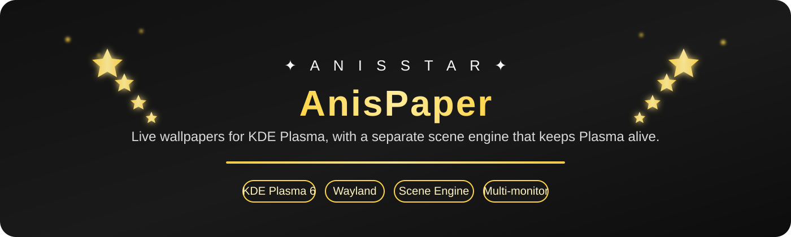

 

 

<h1>✦ A N I S P A P E R ✦</h1>

<h3>Live wallpapers for KDE Plasma — without making <code>plasmashell</code> do all the heavy lifting.</h3>

 

  

<b>
Wallpaper Engine Scene • Video • Web • Multi-monitor • Shared Memory
</b>

  

